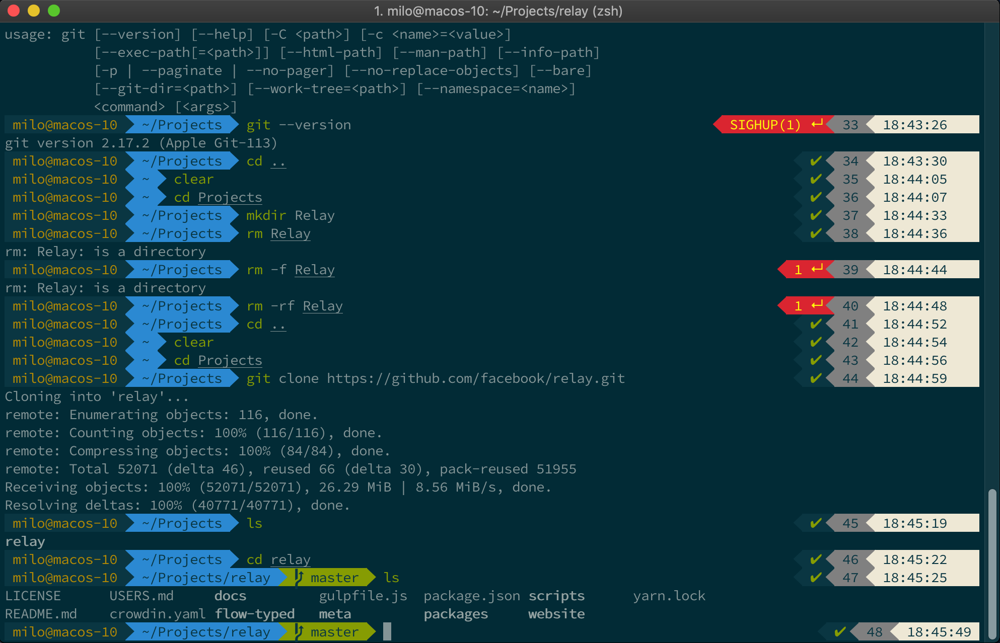

# iTerm2 + oh my zsh + Powerlevel9K

Follow the video tutorial from The Pug Engineer: 
https://www.youtube.com/thepugengineer


## Homebrew
https://brew.sh

Install with:

`/usr/bin/ruby -e "$(curl -fsSL https://raw.githubusercontent.com/Homebrew/install/master/install)"`

You'll need to restart the terminal to finalize the installation. 
Verify it's installed using: 
`brew -v`

## iTerm2
https://www.iterm2.com

Install with:

`brew cask install iterm2`

After installation, close the terminal.
You will need to provide full disk access to iTerm2. 
System Preferences -> Security and Privacy -> Full Disk Access, click the + icon and select iTerm2 from the Applications folder. 

## Zsh
https://ohmyz.sh

Install with:

`brew install zsh` 

Check the version of zsh: `zsh --version`
Make zsh default shell: `chsh -s /bin/zsh`
Check the shell you're using: `echo $SHELL`

## Oh My Zsh
https://ohmyz.sh

Install with:

`sh -c "$(curl -fsSL https://raw.githubusercontent.com/robbyrussell/oh-my-zsh/master/tools/install.sh)"`

## Powerlevel9k
https://github.com/bhilburn/powerlevel9k

Install with: 

`git clone https://github.com/bhilburn/powerlevel9k.git ~/.oh-my-zsh/custom/themes/powerlevel9k`

Edit `~/.zshrc` and set as default theme: 

`ZSH_THEME="powerlevel9k/powerlevel9k"`

### Install the font: 

`https://github.com/powerline/fonts/blob/master/SourceCodePro/Source%20Code%20Pro%20for%20Powerline.otf`
Open with FontBook, and click Install.

Set the font iTerm, make sure size is 14pt: 
iTerm → Preferences → Profiles → Text → Change Font

## Solarize Color Theme
https://raw.githubusercontent.com/mbadolato/iTerm2-Color-Schemes/master/schemes/Solarized%20Dark%20-%20Patched.itermcolors

Save as: `solarize.itermcolors`
Configure the theme in iTerm: iTerm2 -> Preferences -> Profiles -> Colors -> Color Presets -> Import and select the file. 

Select `solarize-dark` from the dropdown.

## zsh Auto Suggestions 

Install with:

 `git clone https://github.com/zsh-users/zsh-autosuggestions ${ZSH_CUSTOM:-~/.oh-my-zsh/custom}/plugins/zsh-autosuggestions`
 
Add the plugin to `~/.zshrc`:
```
plugins=(
  git zsh-autosuggestions
)
```
Tweak the color solarize theme:
iTerm → Preferences → Profiles → Colors tab",  change the value of Black Bright to a lighter color. 


## Syntax Highlighting 

Install with:

`brew install zsh-syntax-highlighting`

Skip to the end of `~/.zshrc` and add the line: 
`source /usr/local/share/zsh-syntax-highlighting/zsh-syntax-highlighting.zsh`

## Word Jumps 

Enable word jumps: 
iTerm → Preferences → Profiles → Keys → Load Preset and select Natural Text Editing

## Change the username@hostname

`whoami` to check your username

Edit `~/.zshrc`

Add:

`DEFAULT_USER = <username>`
